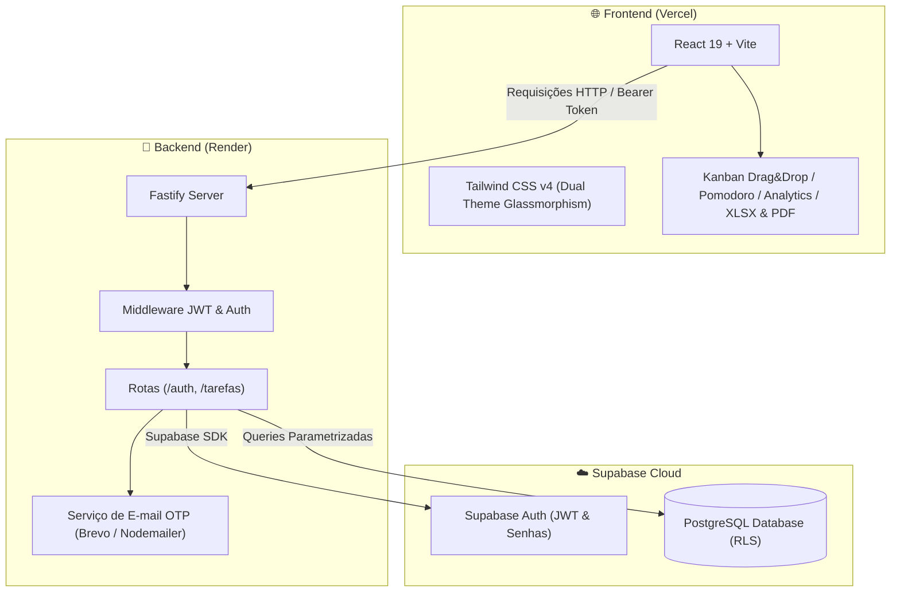

<div align="center">

# 📋 Organizador de Tarefas Pro

### *Plataforma Full Stack de Produtividade, Gestão de Rotina, Kanban e Foco Pomodoro com estética Liquid Glass*

[](https://react.dev/)
[](https://vitejs.dev/)
[](https://tailwindcss.com/)
[](https://www.fastify.io/)
[](https://nodejs.org/)
[](https://supabase.com/)
[](https://vercel.com/)
[](https://render.com/)
[](LICENSE)

<br />

### 🚀 [Acesse a Demonstração Online](https://gerenciador-de-tarefas-flame.vercel.app/)

</div>

---

## 📖 Sobre o Projeto

O **Organizador de Tarefas Pro** é uma aplicação web Full Stack inspirada em ferramentas modernas de alta produtividade (como **Todoist**, **TickTick** e **Notion**), desenvolvida para oferecer um controle completo de estudos, trabalho e rotina pessoal.

A interface combina dois temas com estética **Glassmorphism / Liquid Glass** (**Tema Violeta** e **Tema Dark Midnight Amethyst**), unindo desempenho instantâneo (**Optimistic UI — 0ms**), atalhos globais de teclado, gamificação e ferramentas avançadas de foco.

---

## ✨ Funcionalidades Principais

### ⚡ Produtividade & Gestão Inteligente (Estilo Todoist)
- **⚡ Quick Add com Linguagem Natural (NLP)**:
  - Crie tarefas completas em uma única linha digitando comandos inteligentes:
  - Exemplo: `Estudar Cálculo amanhã @15:00 #Faculdade p1` → extrai automaticamente o título, define a data para amanhã, agenda o horário `15:00`, aplica a categoria `#Faculdade` e define a prioridade como **Urgente (P1)**.
  - Reconhece palavras-chave como `hoje`, `amanhã`, `segunda`, `terça`, `quarta`, `quinta`, `sexta`, `sábado` e `domingo`.
- **🚩 Sistema de Prioridades (`P1` a `P4`) & Categorias (`#Tags`)**:
  - Bandeiras coloridas de prioridade (`P1 Urgente`, `P2 Alta`, `P3 Média`, `P4 Normal`).
  - Pílulas de categorias (`#Faculdade`, `#Trabalho`, `#Pessoal`, `#Saúde`, `#Urgente` ou tags personalizadas) com filtro instantâneo ao clicar.
- **☑️ Subtarefas (Checklist Interativo)**:
  - Adicione etapas dentro de cada tarefa, marque-as diretamente na listagem ou no Kanban e acompanhe a barra de progresso percentual (`X de Y etapas concluídas`).
- **🔁 Tarefas Recorrentes (Rotinas Automáticas)**:
  - Configure repetições **Diárias**, **Semanais** ou **Mensais**. Ao concluir uma tarefa recorrente, o sistema agenda automaticamente a próxima ocorrência com o checklist reiniciado.
- **📝 Notas de Apoio & Pílulas de Links Clicáveis**:
  - Adicione observações ou cole URLs (`https://meet.google.com/...`, `https://github.com/...`). O sistema converte links automaticamente em botões clicáveis com o domínio formatado diretamente no card da tarefa.

---

### 🍅 Foco, Visualizações & Analytics Pro
- **🍅 Timer Pomodoro Flutuante Integrado**:
  - Inicie sessões de foco vinculadas a qualquer tarefa com os modos **Foco (25 min)**, **Pausa Curta (5 min)** e **Pausa Longa (15 min)**.
  - Possui modo compacto (minimizado em pílula), contador de ciclos (`🍅`), botão `+5m`, alerta sonoro via Web Audio API e botão rápido para concluir a tarefa.
- **🖱️ Quadro Kanban com Drag & Drop (Arrastar e Soltar)**:
  - Alterne com 1 clique entre o **Modo Tabela/Lista** e o **Quadro Kanban** de 3 colunas (`Pendente`, `Em andamento`, `Concluído`).
  - Arraste e solte cartões livremente entre as colunas com destaque visual em tempo real e atualização otimista.
- **📊 Painel de Estatísticas e Gráficos (Dashboard Analytics)**:
  - Modal analítico com KPIs gerais (*Total*, *Taxa de Conclusão*, *Foco de Hoje*, *Atrasadas*), barra segmentada de proporção por status, distribuição por nível de prioridade (`P1`–`P4`) e desempenho detalhado por categoria (`#Tag`).
- **📄 Exportação Profissional para Excel (`.XLSX`) e PDF**:
  - **Planilha Excel Nativa (`SheetJS / xlsx`)**: exporta todas as colunas (Título, Início, Término, Horário, Status, Prioridade, Tags, Recorrência, Etapas e Notas) com **largura de coluna calculada automaticamente** para evitar textos cortados ou `########`.
  - **Relatório em PDF (`jsPDF` + `autoTable`)**: gera documento pronto para impressão com cabeçalho personalizado e resumo de produtividade.
- **🔔 Notificações Nativas do Navegador & Alerta Sonoro**:
  - Monitoramento inteligente que envia uma notificação na área de trabalho (`Notification API`) acompanhada de alerta sonoro suave (Web Audio API) quando uma tarefa agendada com horário (`@HH:mm`) está prestes a vencer.
- **🎯 Gamificação & Atalhos de Teclado**:
  - Explosão de confetes (`canvas-confetti`) ao concluir tarefas e celebração especial ao atingir **100% de produtividade**.
  - Atalhos globais: pressione `N` para criar nova tarefa, `/` para focar na busca e `ESC` para fechar modais ou limpar filtros.

---

### 🔐 Segurança, Temas & Gerenciamento de Conta
- **🌗 Seletor de Tema Dual (Violeta Claro & Midnight Amethyst Dark)**:
  - Alternância instantânea com persistência no navegador (`localStorage`).
- **🔐 Autenticação Completa & Segura**:
  - Cadastro com validação de senha forte em tempo real, login JWT, recuperação de senha com código OTP de 6 dígitos (fluxo com privacidade de e-mail via API HTTPS Brevo/Nodemailer) e proteção Row Level Security (RLS) no Supabase.
- **⚙️ Minha Conta**:
  - Edição de nome e e-mail, redefinição de senha e exclusão de conta com confirmação de segurança (`EXCLUIR`).

---

## 🏗️ Arquitetura do Sistema



---

## 🚀 Como Executar o Projeto Localmente

### Pré-requisitos
- [Node.js](https://nodejs.org/) (versão 18 ou superior)
- Gerenciador de pacotes `npm`

### 1. Clonar o Repositório
```bash
git clone https://github.com/rafaelccbr/GerenciadorDeTarefas.git
cd GerenciadorDeTarefas
```

### 2. Configurar o Banco de Dados (Supabase) e Iniciar o Backend

1. Crie um arquivo `.env` dentro da pasta `backend/` baseado no `.env.example`:
```env
SUPABASE_URL=https://seu-projeto.supabase.co
SUPABASE_ANON_KEY=sua-anon-key
SUPABASE_SERVICE_ROLE_KEY=sua-service-role-key
PORT=3000
```

2. No painel do seu Supabase, acesse o **SQL Editor** e execute o comando abaixo para criar a tabela de tarefas com segurança RLS:
```sql
-- 1. Cria o tipo de status
CREATE TYPE status_tipo AS ENUM ('pendente', 'em_andamento', 'concluido');

-- 2. Cria a tabela de tarefas vinculada aos usuários autenticados
CREATE TABLE tarefas (
    id BIGINT GENERATED BY DEFAULT AS IDENTITY PRIMARY KEY,
    created_at TIMESTAMP WITH TIME ZONE DEFAULT timezone('utc'::text, now()) NOT NULL,
    nome TEXT NOT NULL,
    data_come DATE NOT NULL,
    data_termi DATE NOT NULL,
    status status_tipo DEFAULT 'pendente'::status_tipo NOT NULL,
    user_id UUID REFERENCES auth.users(id) ON DELETE CASCADE NOT NULL
);

-- 3. Habilita a proteção Row Level Security (RLS)
ALTER TABLE tarefas ENABLE ROW LEVEL SECURITY;

-- 4. Cria a política de isolamento por usuário
CREATE POLICY "Usuários gerenciam suas próprias tarefas"
ON tarefas FOR ALL
USING (auth.uid() = user_id)
WITH CHECK (auth.uid() = user_id);
```

3. Instale as dependências e inicie o servidor:
```bash
cd backend
npm install
npm run dev
```
> O servidor Fastify iniciará em `http://localhost:3000`.

### 3. Configurar e Iniciar o Frontend
Em um novo terminal:
```bash
cd frontend
npm install
npm run dev
```
> A aplicação React + Vite estará disponível em `http://localhost:5173`.

---

## 📄 Licença

Este projeto está sob a licença [MIT](LICENSE).
