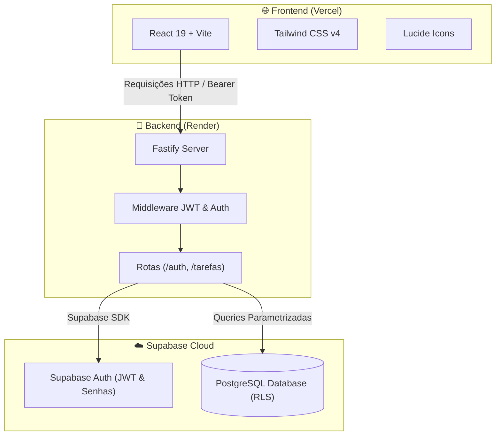

<div align="center">

# 📋 Organizador de Tarefas

### *Gerenciador pessoal de tarefas Full Stack com autenticação segura e estética Glassmorphism*

[](https://react.dev/)
[](https://vitejs.dev/)
[](https://tailwindcss.com/)
[](https://www.fastify.io/)
[](https://nodejs.org/)
[](https://supabase.com/)
[](https://vercel.com/)
[](https://render.com/)
[](LICENSE)

<br />

### 🚀 [Acesse a Demonstração Online](https://gerenciador-de-tarefas-flame.vercel.app/)

</div>

---

## 📖 Sobre o Projeto

O **Organizador de Tarefas** é uma aplicação web Full Stack desenvolvida para proporcionar um controle de rotina e produtividade prático, rápido e visualmente sofisticado.

A aplicação adota a estética visual **Glassmorphism / Liquid Glass**, combinando fundos translúcidos jateados, chanfros luminosos, efeitos de desfoque (*backdrop blur*) e anéis de foco neon violeta, garantindo uma experiência de usuário elegante e responsiva tanto em desktops quanto em dispositivos móveis.

---

## ✨ Principais Funcionalidades

- 🔐 **Autenticação Completa & Segura**:
  - Cadastro com requisitos de senha forte (mínimo 8 caracteres, letra maiúscula, número e caractere especial).
  - Checklist interativo em tempo real que surge dinamicamente ao focar no campo de senha.
  - Login seguro com geração de tokens JWT.
  - Recuperação de senha por e-mail integrada ao Supabase Auth.
- 📋 **CRUD Completo de Tarefas**:
  - Criação de tarefas com prazos (data de início e de término).
  - Listagem ordenada e isolada por usuário autenticado.
  - Edição completa e atualização dinâmica de informações.
  - ⚡ **Atualização Otimista (Optimistic UI - 0ms)**: alternância instantânea de status e exclusão de tarefas sem delay perceptível.
- 🏷️ **Controle de Status com Badges**:
  - `Pendente` (Neutro / Aguardando início)
  - `Em andamento` (Violeta / Em progresso)
  - `Concluído` (Verde Esmeralda / Finalizada)
- 📱 **Design Responsivo & Mobile-First**:
  - **Exibição Híbrida Inteligente**: Tabela ampla de 5 colunas no Desktop/Tablet e **Cards de Tarefas Individuais** no celular, eliminando completamente a rolagem horizontal em telas pequenas.
  - Modais com proteção de altura dinâmica (`max-h-[90dvh]`), garantindo acessibilidade mesmo quando o teclado virtual estiver aberto.
- ⚙️ **Gerenciamento de Conta ("Minha Conta")**:
  - Centralizado no badge do usuário com engrenagem animada.
  - Atualização cadastral de **Nome** e **E-mail**.
  - Redefinição de senha com validação completa dos 4 requisitos.
  - Zona de perigo: exclusão definitiva de conta e tarefas associadas com confirmação textual (`EXCLUIR`).
- 📜 **Termos de Uso e Privacidade**:
  - Modal translúcido com scroll suave e aceite inteligente automatizado.

---

## 🎨 Design & Identidade Visual

A interface foi projetada sob o conceito de **Vidro Translúcido Líquido (Liquid Glass)**:
* **Cards & Modais**: Gradientes profundos de violeta escuro (`#2f0440` a `#1c0228`) com `backdrop-blur-2xl` e chanfro reflexivo (`inset_0_1px_1px_rgba(255,255,255,0.3)`).
* **Botões em Vidro com Brilho Funcional**: Ações de cadastro/salvamento em esmeralda translúcido nítido e ações de perigo/saída em rosé/ruby translúcido, com alto contraste e leitura em branco puro.
* **Inputs de Alto Contraste**: Fundo claro com anel luminoso de foco neon violeta (`focus:ring-4 focus:ring-purple-400/50`).

---

## 🏗️ Arquitetura do Sistema



---

## 🚀 Como Executar o Projeto Localmente

### Pré-requisitos
- [Node.js](https://nodejs.org/) (versão 18 ou superior)
- Gerenciador de pacotes `npm`

### 1. Clonar o Repositório
```bash
git clone https://github.com/rafaelccbr/GerenciadorDeTarefas.git
cd GerenciadorDeTarefas
```

### 2. Configurar o Banco de Dados (Supabase) e Iniciar o Backend

1. Crie um arquivo `.env` dentro da pasta `backend/` baseado no `.env.example`:
```env
SUPABASE_URL=https://seu-projeto.supabase.co
SUPABASE_ANON_KEY=sua-anon-key
SUPABASE_SERVICE_ROLE_KEY=sua-service-role-key
PORT=3000
```

2. No painel do seu Supabase, acesse o **SQL Editor** e execute o comando abaixo para criar a tabela de tarefas com segurança RLS:
```sql
-- 1. Cria o tipo de status
CREATE TYPE status_tipo AS ENUM ('pendente', 'em_andamento', 'concluido');

-- 2. Cria a tabela de tarefas vinculada aos usuários autenticados
CREATE TABLE tarefas (
    id BIGINT GENERATED BY DEFAULT AS IDENTITY PRIMARY KEY,
    created_at TIMESTAMP WITH TIME ZONE DEFAULT timezone('utc'::text, now()) NOT NULL,
    nome TEXT NOT NULL,
    data_come DATE NOT NULL,
    data_termi DATE NOT NULL,
    status status_tipo DEFAULT 'pendente'::status_tipo NOT NULL,
    user_id UUID REFERENCES auth.users(id) ON DELETE CASCADE NOT NULL
);

-- 3. Habilita a proteção Row Level Security (RLS)
ALTER TABLE tarefas ENABLE ROW LEVEL SECURITY;

-- 4. Cria a política de isolamento por usuário
CREATE POLICY "Usuários gerenciam suas próprias tarefas"
ON tarefas FOR ALL
USING (auth.uid() = user_id)
WITH CHECK (auth.uid() = user_id);
```

3. Instale as dependências e inicie o servidor:
```bash
cd backend
npm install
npm run dev
```
> O servidor Fastify iniciará em `http://localhost:3000`.

### 3. Configurar e Iniciar o Frontend
Em um novo terminal:
```bash
cd frontend
npm install
npm run dev
```
> A aplicação React + Vite estará disponível em `http://localhost:5173`.

---

## 📄 Licença

Este projeto está sob a licença [MIT](LICENSE).
